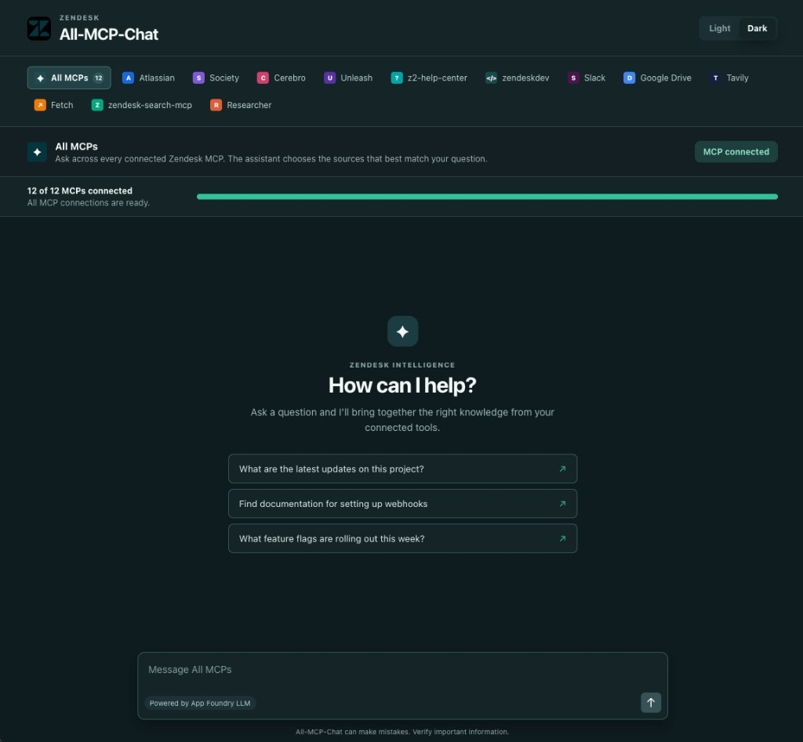

# All-MCP-Chat

**Experimental.** A Zendesk-internal workspace to test every available Zendesk MCP as a chatbot. Pick one MCP tab, connect it, and ask questions against that source only.

This is not a production knowledge system. Answers can be incomplete when an MCP cannot return full page, thread, or record content. Verify important information in the source.

**Live app:** [https://all-mcp-chat.internal.zenai-apps.com/](https://all-mcp-chat.internal.zenai-apps.com/)

Author: [ldeguzman-ai on GitHub](https://github.com/ldeguzman-ai?tab=repositories)

The live URL is behind Zendesk Pomerium SSO. You must be signed in on the Zendesk network or VPN.



## How it works

- Choose one MCP, then chat.
- MCPs have a green or gray connection dot.
- Chat remembers the **last 10 user prompts** (plus replies) for the **selected tab**, in this browser session only. Refresh starts a new conversation.
- Factual questions trigger MCP tools. The model searches, then retrieves the primary page, record, thread, or document before answering.
- Source pages used in the answer appear as **1–2 clickable markdown links** in the reply (and optional source chips).
- Each MCP has its own research playbook (see below). Atlassian, for example, must open the full Confluence page or Jira issue and inspect expand/dropdown/macro content instead of answering from a search snippet.

## When you need to connect MCP

Connect **once per browser account** (your SSO email) before tools can run.

Connect when:

- The header shows **Connect MCP** instead of **MCP connected**
- A tab has a gray status dot
- Chat says tools are not connected and gives a connect link
- You are using the app for the first time, or tokens expired

You do **not** need to connect again for every question. After the dots are green, just chat. Switching tabs does not disconnect anything; it only changes which tools that question can use.

Plain greetings can still get a reply without tools. Lookups need a connected MCP.

## Experience when connecting

1. Open the [live app](https://all-mcp-chat.internal.zenai-apps.com/).
2. Select the MCP tab you want, then click **Connect MCP**, or open  
   `https://all-mcp-chat.internal.zenai-apps.com/?mcp_connect=atlassian`  
   (replace `atlassian` with any source id below).
3. The page **reloads** as that MCP is authorized. That is expected.
4. You only need to interact if:
   - a page asks you to **allow** that MCP, or
   - **Society** asks you to log in as an **agent** or **end user**
5. After approval you return to the app with a green dot on that tab.

To connect every MCP, repeat for each tab. The gateway allows **one MCP binding per login**, so they cannot finish in a single consent screen.

## MCP sources and instructions

These are the research instructions the chat uses for each tab.

### Atlassian (`atlassian`)

Jira issues and Confluence pages.

- Search narrowly by the exact system, process, or role, plus space, project, label, status, or recency when available.
- Open the selected page or issue by page id, content id, or issue key. Search snippets are locators only.
- Inspect the full body. For Confluence, prefer rendered view/HTML or ADF so Expand, Details, dropdowns, Page Properties, includes, and tables are not stripped by markdown conversion.
- Match the exact product or system (for example NetSuite vs Monitor User Access Reviews). Do not reuse an approver from a neighboring row, region, or role.
- For Jira, distinguish current fields from historical comments. Cite the opened page or issue, section, and updated time when available.
- If collapsed or embedded content is still missing, say so. Do not invent a name, owner, or date.

### Society (`society`)

Zendesk internal Society knowledge and community content.

- Search related posts, then retrieve the full entry, accepted answer, comments, revisions, and linked canonical resources.
- Ranking is a discovery signal, not correctness. Distinguish official guidance, community consensus, and an individual report.
- Keep audience, product, region, and date limits. If posts disagree, summarize the disagreement.

### Cerebro (`cerebro`)

Internal operational and systems knowledge.

- Retrieve the applicable runbook and current change or incident context first, then related services, lessons, or postmortems.
- Verify environment, service, owner, hazards, blast radius, approvals, rollback, validation, and last-verified time before treating a procedure as safe.
- Never infer live production state from an old runbook.

### Unleash (`unleash`)

Feature flags, targeting, and rollout.

- Resolve the exact flag, project, and environment, then retrieve the full definition: strategies, constraints, segments, variants, and rollout.
- Do not call a flag globally enabled from one environment. Distinguish configured state from evaluation for a user or request.
- If the name or environment is ambiguous, ask or retrieve exact matches. Do not expose targeting identifiers or credentials.

### z2-help-center (`z2-help-center`)

Zendesk Help Center articles.

- Search, then open the full published article and metadata. Prefer official Help Center pages over comments or third-party pages.
- Preserve plan, product, channel, locale, and visibility. Do not mix Guide, Support, Messaging, or Sunshine unless the article says they share behavior.
- On conflict, use the newest applicable published article and mention the conflict. Search indexing can lag updates.

### zendeskdev (`zendeskdev`)

Zendesk developer docs and APIs.

- Open the official reference page plus linked auth, pagination, and rate-limit pages. Prefer reference docs over tutorials.
- Verify product, endpoint, version, auth, scopes, parameters, pagination, limits, and errors. Do not invent fields or payloads.
- State which API applies (v1 vs v2, Support vs Sunshine). Never expose tokens, subdomains, or customer IDs.

### Slack (`slack`)

Messages, channels, and threads.

- Search, then retrieve surrounding context and the complete thread (paginate replies). A single search hit is not enough.
- Preserve author, time, edits, order, reactions, files, and linked docs when they change the meaning.
- Treat Slack as discussion, not policy. Prefer an approved linked document when one exists. Return only what answers the question.

### Google Drive (`google-drive`)

Files, Docs, Sheets, and shared Drive content.

- Search by title, type, folder, and modified time, then retrieve by file id and read the real document or export.
- For Sheets, keep the exact tab, range, column, and row. Do not flatten tables into misleading prose.
- Only call a file current when metadata supports it. Say when an export omits comments, formulas, or layout.

### Tavily (`tavily`)

Public web search.

- Plan the evidence needed, search, rank by authority and recency, then open canonical sources for each material claim.
- Prefer official docs, regulators, filings, and direct statements. Snippets, rankings, and AI summaries are not evidence.
- For current or disputed facts, corroborate independently, state an as-of date, and surface unresolved conflicts.

### Fetch (`fetch`)

Retrieve a specific URL.

- Fetch the canonical URL and answer only from the retrieved body.
- If the page is incomplete or JavaScript-rendered, retry once with a rendering reader if available. Do not bypass logins, paywalls, or access controls.
- Quotes must match fetched text. Never guess from the URL or title.

### zendesk-search-mcp (`zendesk-search-mcp`)

Zendesk Support tickets, users, and organizations.

- Determine the object type, query narrowly, then open the primary record. Prefer ticket id, email or external id, and exact org name.
- Verify current status from the record, not a search title. Do not merge identities because names match.
- Return the minimum authorized data. Omit unrelated PII, internal notes, and comments unless needed to answer.

### Researcher (`researcher`)

Deeper multi-step research.

- Plan subquestions and evidence gaps, retrieve primary sources, compare conflicts, then report what was verified vs uncertain.
- Each tool call should fill one named gap. Do not repeat the same call or chase tangential facts.
- Stop when claims are supported or the call budget is reached; then return the best supported partial answer.

## Run locally

```bash
npm install
npm run dev
```

Without `VITE_CHAT_ENDPOINT`, the UI is a local preview and does not call the LLM or MCP.

Production chat goes to `POST /api/chat`. LLM access is App Foundry / Vertex workload identity. MCP auth is per-user OAuth against `https://mcp-gateway.zende.sk` (no shared gateway secret). Encrypted tokens are stored in Postgres.

The production server entry is `foundry/index.js` (deployed as Gitea root `index.js`). Built UI files go in `public/` (flattened hashed JS/CSS, `index.html`, and `zendesk-mark.png`).
